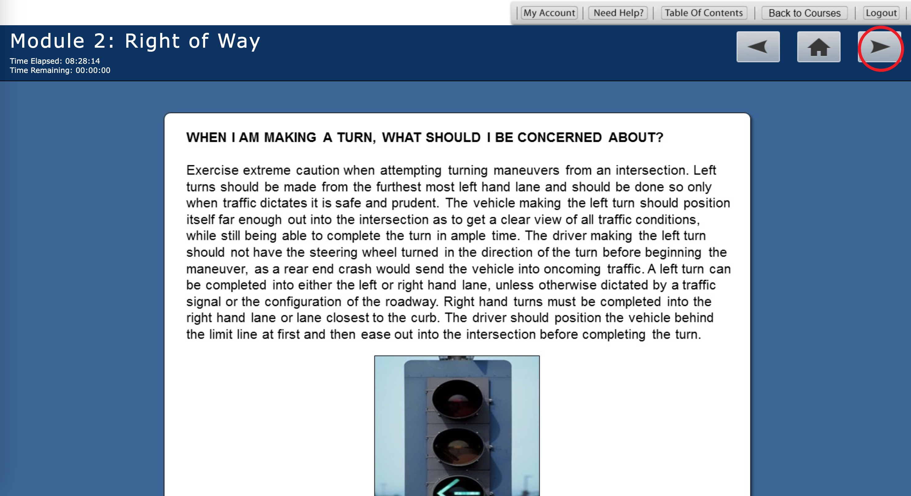

# AutoTXDrivingClasses
Automatically finish the classes from Texas Driving School

1. Download the script: `git clone git@github.com:xliaoyi/AutoTXDrivingClasses.git`
2. Run the script: `python autoClass.py`
3. Put the cursor on the right arrow 
4. Wait for 6 hours
